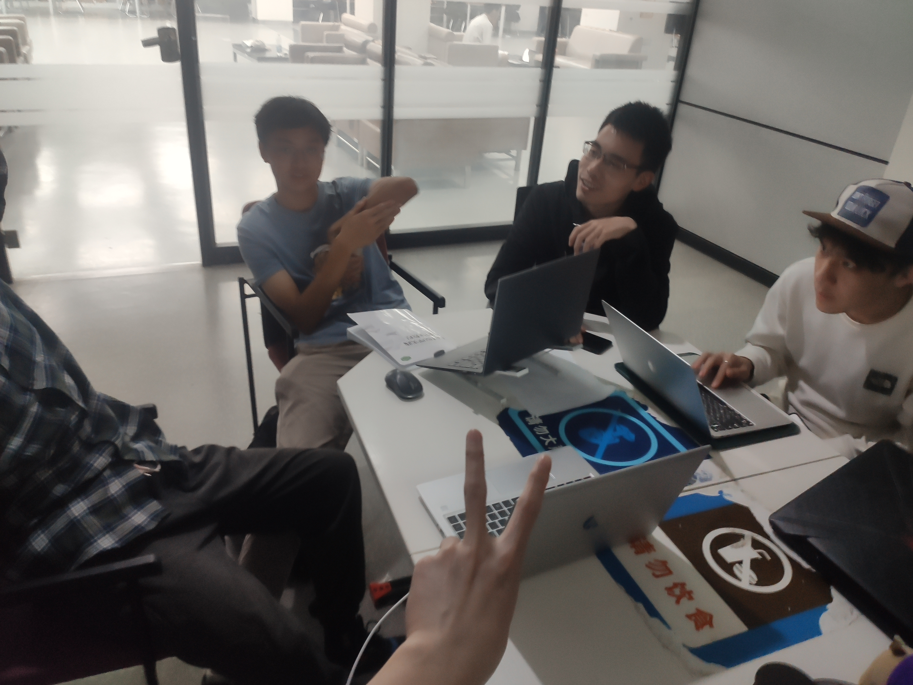

# D-杨组第六次全组代表大会会议纪要

[toc]

| 会议时间  | 会议周期 |  会议地点  |                         与会人员名单                         |
| :-------: | :------: | :--------: | :----------------------------------------------------------: |
| 2022-0506 |    1h    | 杜夏图书馆 | 杨茂琛\_*组长*、孙逸扬\_*技术负责人*、张世茂、王岳、姜宁、戴显灏\_*书记员* |

## 会议主题

> **同步进度**

目前已经做了合同管理服务中的增删改查操作、文件转换pdf服务

> **测试问题**

单元测试往后延期（因为目前单元测试代码量过大，并且单元测试不完备）

先将服务完善后做集成测试

> **舍弃并发缓存（cache）**

由孙逸杨提出的并发缓存的设计由于满足一致性很难满足，并且考虑到并发量不大，所以舍弃并发缓存设计

> **并发设计思想分析**

我们选择在数据库层加唯一锁，而非在业务层加分布式锁

> **将表的增删改查全部写完**

任务分配：一人进行一个表的编写，本周内做完所有业务的增删改查操作

