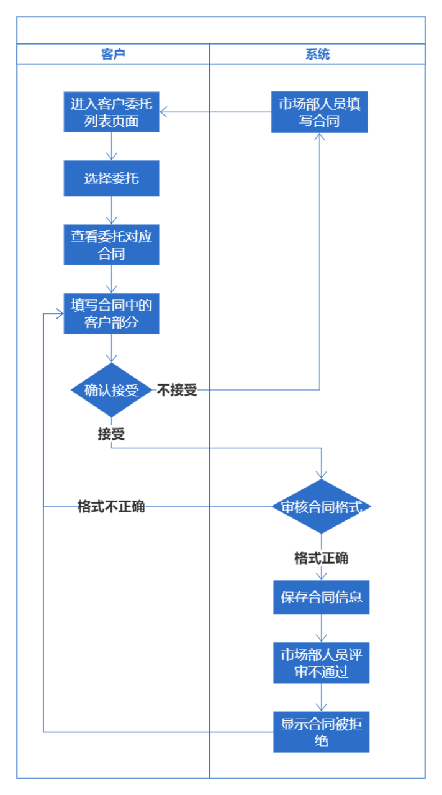
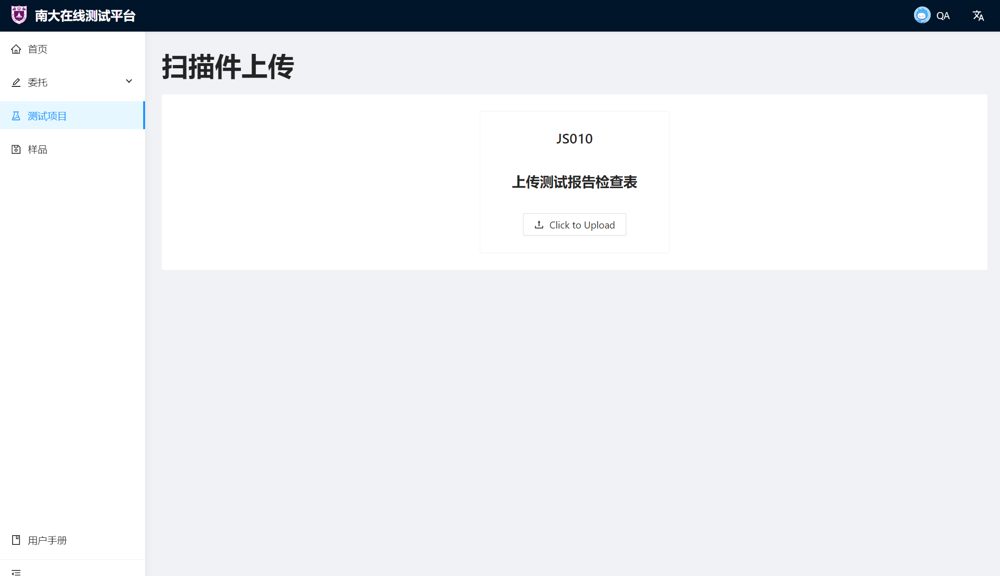

# 需求规格文档

项目名称：南京大学软件测试中心在线业务平台

指导老师：曹春

版本号：0.0.1

## 目录

[TOC]

## 1. 引言

### 1.1 编写目的

通过该需求规格说明文档，为产品整体的功能需求和结构要求进行刻画和规定。通过对产品各个方面的描述，加深开发人员以及用户对于产品整体的认识，使产品开发人员在开发过程中对产品整体的需求把控更加精准。在开发过程中，开发人员可以以该需求规格文档为大纲进行开发，能够有效地避免发生功能的遗漏或具体实现与实际需求间的偏差，从而减少后期不必要的额外劳动。同时，由于需求规格文档是开发人员和委托方都可见的，因此也可以方便委托方和开发人员的沟通，降低沟通成本，在出现需求方面的异议或问题是可以及时沟通并解决。项目开发和交付的整个流程需求相关的讨论都基于此文档进行，文档会根据实际需求的变更进行实时更新，一切需求相关的问题以此文档的内容为准。

### 1.2 预期读者

该需求文档预期的读者主要包括项目开发人员、项目管理者、项目委托方客户、测试人员、系统最终各部门的使用者等，针对不同的目标读者文档都包含了其需要关注的相关信息，不同类型的读者可根据自己的具体需要参阅其中相关的部分。文档的剩余部分还会依次对产品的功能需求进行一个综合描述，并对产品的外部接口需求、系统功能特性、以及其他必要的非功能性需求等进行说明和介绍。

对于开发人员，应当重点关注文档中产品的综合描述，这有助于您建立一个对于产品全局的认识，更好地进行产品的设计和开发，同时设计出的产品也可以更好地切合客户的实际需求，同时还应当关注文档中有关外部接口需求、系统特性、其他非功能性需求有关的描述，这些部分有关开发过程中所应注意的部分细节和增强性需求。在开发过程中应当以文档中的内容为基准，在对文档内容有疑问时请联系文档的编写者或项目开发的管理者，以便于委托方客户能够尽快与您就相关问题进行对接。

对于项目的管理者，建议着重关注文档中有关产品综合描述以及系统特性，这有助于您更好地快速建立一个对于产品需求的全面认识和宏观把控，可以帮助您更好地进行整个项目的管理和把控。由于在项目开发的过程中，委托方或开发人员在项目进行过程中都有可能就项目需求方面的问题联系您，因此您可以依据此文档中的相关问题建议一个对产品的准确认识，并在需要时进行快速的查阅，这有助于您更好地进行项目的管理并解决项目开发过程中遇到的问题。

对于项目委托方客户，建议着重关注与产品功能性与非功能性特性相关的部分，这有助于您清晰地掌握与产品在具体使用中表现相关的信息。因为您是产品的主要使用者，因此您无需太过关心与产品开发、测试和维护相关的内容。文档中会具体地列出产品在使用中需要满足的需求，请您及时检查这些内容与您的要求有无出入，若有疑问请及时与文档的编写者或项目开发的管理者进行联系。

对于测试人员，建议您重点关注对产品的要求，即”系统特性“和”其他非功能性需求“部分，由于这些是对产品在实际使用过程中提出的要求，因此您需要针对它们进行系统的测试工作，以保证项目在实际运行中能够较好地满足客户的需求。

对于系统最终各部门的使用者，该需求规格说明文档是对产品需求的一个完整的总述和规范，可供您在使用时查阅，这可以帮助您对您正在使用的产品的功能建立一个完整的认识。您可以根据您的需要重点关注相关的内容，这可以帮助您在使用过程中快速地掌握相关功能的概貌和用法。

对于上文中没有提到的读者，您可以根据自己的具体需要选择性地对文档进行阅读。如果您属于上文中提到的读者类型，由于开发过程中具体的情况难以预测，您也可以根据自己的需要选择主要参考的部分。

### 1.3 背景

“南大测试”项目在线管理平台主体为”南大测试“在线业务WEB应用。主要是通过该项目在线管理平台提高业务处理的效率和管理的方便性，优化业务流程，同时为机构的服务质量提质，从整体上全面地提升客户的体验。各个功能之间相互辅助，从不同维度为用户提供服务，实现的在线业务WEB应用可以帮助希望委托南京大学软件测试中心进行软件测试的客户方便地完成对业务申请管理、信息查询等相关的全流程覆盖的服务，并能够为测试中心工作人员提供从接受委托到完成整个委托全流程的管理。

### 1.4 相关定义

| 术语/缩略词 |                             定义                             |
| :---------: | :----------------------------------------------------------: |
|     WEB     | 全球广域网，也称为万维网，它是一种基于超文本和HTTP的、全球性的、动态交互的、跨平台的分布式图形信息系统 |
|   C/S架构   |         服务器-客户机架构，即Client-Server(C/S)结构          |
|   B/S架构   | 浏览器/服务器体系结构，即Browser/Server(B/S)这种体系结构可以理解为是对 C/S 体系结构的改变和促进 |
|     CRM     |    即客户关系管理，全称为Customer Relationship Management    |
|   DevOps    | DevOps（Development和Operations的组合词）是一组过程、方法与系统的统称，用于促进开发（应用程序/软件工程）、技术运营和质量保障（QA）部门之间的沟通、协作与整合。它是一种重视“软件开发人员（Dev）”和“IT运维技术人员（Ops）”之间沟通合作的文化、运动或惯例。透过自动化“软件交付”和“架构变更”的流程，来使得构建、测试、发布软件能够更加地快捷、频繁和可靠。 |

### 1.5 参考资料

《南京大学软件测试中心在线业务平台需求文档》

《南京大学软件测试中心在线业务平台设计说明书》

《南京大学软件测试中心在线业务平台用户手册》

GB/T 8567-2006 《计算机软件文档编制规范》

GB/T 30961-2014 《嵌入式软件质量度量》

GB/T 25000.10-2016 《系统与软件工程系统与软件质量要求和评（SQuaRE）第 10 部分：系统与软件质量模型》

GB/T 25000.51-2016 《系统与软件工程系统与软件质量要求和评（SQuaRE）第 51 部分：就绪可用软件产品（RUSP）的质量要求和测试细则》

GB/T 28452-2012 《信息安全技术应用软件系统通用安全技术要求》

## 2. 任务概述

### 2.1 任务目标

在线业务WEB应用平台主要是要针对具体测试项目的相关事宜进行管理。具体来说包括用户管理、客户管理、委托管理、合同管理、样品管理、报告管理、测试管理、在线审批等等功能模块。测试在线业务平台基于一系列经过需求调研后既定的流程进行开发，需要对整个项目可能进行到的流程状态进行管理，并基于此提供对应的服务和相关的权限控制。权限控制既包括不同类型人员可以进行的操作类型，也包括在不同的流程阶段可以进行的操作权限控制。在线业务平台用户包括以下几种类型：超级管理员ADMIN、客户CUSTOMER、市场部主管MARKETING_SUPERVISOR、市场部员工MARKETER、测试部主管TESTING_SUPERVISOR、测试部员工TESTER、质量部主管QA_SUPERVISOR、质量部员工QA，应对他们施加不同的操作权限控制。

### 2.2 用户特点

|     用户身份     |                           用户特点                           |
| :--------------: | :----------------------------------------------------------: |
|    委托方客户    | 一般为拥有软件开发业务线的软件公司或团队，拥有对已有的软件产品进行测试的需求，需要在南大测试在线业务平台上进行测试委托，并在线完成整个委托测试流程的主要操作 |
|    系统管理员    | 一般为业务系统中拥有最高权限的账户，一般用于为系统中的其他非客户账户赋予相应的权限信息，并在必要时代替对应的用户执行对应的操作 |
|   系统运维人员   | 本项目的软件工程师，用于本产品日常运行时的维护更新以及出现故障时的处理 |
|   测试中心员工   | 南京大学软件测试中心的普通员工，一般使用该系统进行测试委托业务的执行与管理。一般包括市场部、测试部、质量部员工，根据用户身份的不同需要在测试项目的不同阶段进行不同的操作，且不同人员之间的权限划分应当是明确的 |
| 测试中心部门主管 | 南京大学软件测试中心的市场部主管、测试部主管、质量部主管，需要监督管理其所在部门员工所负责的对应的工作流程，在必要时也可能需要执行一些必要的操作，如删除某些文档、代替员工填写某些表格、下载某些与其有关的文档等等 |

### 2.3 假定和约束

文档中提出的需求和规范都具有继承性，即低层级的细化需求和规范继承高层级的需求和规范，高层级的规范要求可向低层级覆盖。

开发过程中全体开发人员的工作都与需求规格说明文档中的内容保持严格一致。

开发过程中产生的问题在确认需要调整后，需求规格文档将及时作出调整，并同步更新到各个人员处。

项目开发人员在开发过程中将根据需求自主选择并学习合适的技术。

## 3. 需求规定

### 3.1 对功能的规定

针对在线业务平台的业务需求，我们对整体的委托测试项目流程中进行的所有操作有以下流程图：

#### 3.1.1 委托管理（客户交互部分）

**功能描述：**

客户与测试中心在线业务平台系统的委托管理部分涵盖了软件项目委托测试申请表、委托测试软件功能列表、报价单等内容，以及客户在委托申请评审过后，需要看到软件文档评审的结果信息。系统应当为客户提供新建委托、填写委托、提交委托、查看委托、修改委托、确认/拒绝报价单等操作。系统需保证在不同执行相关操作动作阶段后，客户可以查看到委托管理部分(客户视图)的新增委托申请字段/子表的内容，即要求系统按照活动图进行流程操作的阶段检查。

**活动图：**

**功能详述：**

- 新建委托：客户新建一个委托，在线业务平台展示一个空白的委托申请页面，出于面向客户服务的业务需求，该新建委托动能操作应被设计为只能由客户操作完成，故系统需在此作权限验证，保证操作意义的合理性。委托创建后，系统应当保存该委托在数据库中的ID编号，以方便后续维护委托申请。
- 填写/提交委托：在线业务平台应当为客户提供的委托表单填写内容为软件项目委托测试申请表的大部分内容以及委托测试软件功能列表的全部内容。客户在填写后，可以将委托表单提交给在线业务平台，平台应当将新提交的表单内容更新到数据库服务器中，并设置委托管理操作的新的活动状态。在这一操作中，系统应当在客户提交委托时，检查该委托对应的操作活动状态的合理性，若当前活动状态不符合操作的活动流程(见上图)，则应拒绝该委托的提交。
- 查看委托：在线业务平台应当保证客户对委托申请的查看权限，并及时显示出当前该委托所进行到的操作流程状态。此处根据现实情况需要，平台系统需提供根据委托某些关键字段的筛选查找及分页展示查找结果的效果，以保证客户浏览的舒适性。平台系统应当保证客户身份与查看的委托申请的创建者身份的一致性，保证客户的委托信息不会被无关人员窃取。
- 修改委托：在线业务平台应当在对应的操作流程活动状态下为客户提供修改委托的操作功能。除了对流程状态的检查以外，平台系统还应当检查客户身份与待修改委托的创建者身份的一致性，从而保证业务平台的安全可靠性。(其他说明与填写/提交委托一致)
- 接收/拒绝委托报价：在系统内部审核通过客户提交的委托后，在线业务平台应当为客户展示系统内部提供的报价单信息。客户可选择接收该委托报价或者拒绝该委托报价

**界面原型：**

- 新建委托
- 填写/提交委托
- 查看委托
  - 委托列表
  - 委托进度
  - 委托申请内容
- 接收/拒绝委托报价

#### 3.2.2 委托管理（市场部、测试部人员交互部分）

**功能描述：**

市场部/测试部人员与测试中心在线业务平台系统的委托管理部分包括了软件项目委托测试申请表、委托测试软件功能列表、软件文档评审表、报价单等内容。系统应当为市场/测试部人员提供查看委托、填写委托评审、填写委托报价单、确认/拒绝受理等操作。系统需保证在执行相关活动流程图中的操作后，市场/测试部人员能够看到相应新增的表单字段，同时系统应对操作员的权限做相应合理性检查。

**活动图：**

**功能详述：**

- 查看委托：在线业务平台应当保证市场/测试部人员对委托的查看权限，并及时显示出当前该委托产看所进行到的操作流程状态。此处根据现实情况需要，平台系统需提供根据委托某些关键字段的筛选查找及分页展示查找结果的效果，以保证内部人员浏览的舒适性。平台系统应当保证市场/测试部人员的身份与该委托所分派的市场/测试部人员身份的一致性，保证委托信息只被相关人员查看(包括上述两个部门的主管)。
- 填写/提交评审：在线业务平台应当为市场/测试部人员提供对软件文档评审表及软件项目委托测试申请表的审核字段的填写及提交操作。平台系统应当首先对委托的活动状态及操作人员的身份进行验证，以保证操作的合法性；然后操作人员点击提交后，上述内容应当通过后端提供相应接口保存到数据库服务器中，并按照操作活动图设置操作完成后的对应状态。
- 修改评审：在线业务平台应当为市场/测试部人员提供上述评审内容的修改操作。平台系统需先对当前委托的活动状态及操作人员的身份加以验证，在通过后，允许操作人员修改评审内容并在提交后将新的评审内容更新到数据库服务器中，委托的活动状态应当不受影响。
- 修改报价单：在线业务平台应当为市场/测试部人员提供上述报价单内容的修改操作。平台系统需先对当前委托的活动状态及操作人员的身份加以验证，在通过后，允许操作人员修改评审内容并在提交后将新的评审内容更新到数据库服务器中，委托的活动状态应当不受影响。

**界面原型：**

- 填写/提交评审
- 修改报价单

#### 3.2.3 合同管理（客户交互部分）

**功能描述：**

客户与测试中心在线业务平台系统的合同管理部分涵盖了软件委托测试合同、软件项目委托测试保密协议等内容，以及客户在合同填写评审过后，需要看到合同审核的结果信息。系统应当为客户提供查看合同、填写合同、提交合同、修改合同、确认/拒绝合同等操作。系统需保证在不同执行相关操作动作阶段后，客户可以查看到合同管理部分(客户视图)的新增合同的更新信息及活动状态，即要求系统按照活动图进行流程操作的阶段检查。

**活动图：**

**功能详述：**

- 查看合同：在线业务平台应当保证客户对合同的查看权限，并及时显示出当前该合同所进行到的操作流程状态。具体流程为通过委托ID查找到与之对应的合同ID,然后根据合同ID查找到合同具体内容。此处根据现实情况需要，平台系统需提供根据合同某些关键字段的筛选查找及分页展示查找结果的效果，以保证客户浏览的舒适性。平台系统应当保证客户身份与查看的合同对应的客户身份的一致性，保证客户的委托信息不会被无关人员窃取。
- 填写/提交合同：在线业务平台应当为客户提供合同中与客户信息有关内容的填写和提交操作。客户在填写后，可以将合同表单提交给在线业务平台，平台应当将新提交的表单内容更新到数据库服务器中，并设置合同管理操作的新的活动状态。在这一操作中，系统应当在客户提交合同时，检查该合同对应的操作活动状态的合理性，若当前活动状态不符合操作的活动流程(见上图)，则应拒绝该合同的提交。
- 接收/拒绝合同：在系统内部审核通过客户提交的委托后，在线业务平台应当为客户展示内部人员创建并已填写好的部分合同信息信息。客户可选择接收已填的合同信息(受托方相关)或者拒绝已填的合同信息。平台系统应当根据操作按活动图更新对应的操作活动状态。
- 修改合同：在线业务平台应当在对应的操作流程活动状态下为客户提供修改合同的操作功能。除了对流程状态的检查以外，平台系统还应当检查客户身份与待修改合同对应的客户身份的一致性，从而保证业务平台的安全可靠性。每次修改后，系统都应将客户提交的新的合同内容保存到数据库服务器中。
- 查看合同保密协议：此保密协议无客户需填写字段，仅为根据实际业务需要，以附件浏览的形式，保证客户知悉相关保密规定，方便后续双方的沟通与协调。

**界面原型：**

- 查看合同（描述：合同填写完成后点击合同填写流程进入合同展示界面）
- 填写/提交合同/修改合同
- 接收/拒绝合同

#### 3.2.4 合同管理（市场部交互部分）

**功能描述：**

市场部人员与测试中心在线业务平台系统的合同管理部分包括了软件委托测试合同、软件项目委托测试保密协议等内容。系统应当为市场部人员提供查看合同、填写合同、审核合同、修改合同、填写合同保密协议、上传合同扫描件等操作。系统需保证在执行相关活动流程图中的操作后，市场部人员能够看到相应新增的表单字段，同时系统应对操作员的权限做相应合理性检查。

**活动图：**

**功能详述：**

- 查看合同：在线业务平台应当保证市场部人员对合同的查看权限，并及时显示出当前该合同所进行到的操作流程状态。具体流程为通过委托ID查找到与之对应的合同ID,然后根据合同ID查找到合同具体内容。此处根据现实情况需要，平台系统需提供根据合同某些关键字段的筛选查找及分页展示查找结果的效果，以保证市场部人员浏览的舒适性。平台系统应当保证市场部人员身份与查看的合同对应的市场部人员身份的一致性，保证合同信息只被相关人员查看(包括上述两个部门的主管)。
- 填写/提交合同：在线业务平台应当为市场部人员提供合同中与受托方信息有关内容的填写和提交操作。市场部人员在填写后，可以将合同表单提交给在线业务平台，平台应当将新提交的表单内容更新到数据库服务器中，并设置合同管理操作的新的活动状态。在这一操作中，系统应当在市场部人员提交合同时，检查该合同对应的操作活动状态的合理性，若当前活动状态不符合操作的活动流程(见上图)，则应拒绝该合同的提交。
- 审核合同：在线业务平台需为市场部人员提供对客户提交的合同信息进行审核的操作。业务平台首先完成对操作人员身份与合同指定的市场部人员身份进行一致性检查，并同时对合同和活动状态完成检查。然后根据操作人员的操作，按照活动状态转移(见上图)到对应的活动状态，并将合同的新的活动状态保存至数据库服务器中。
- 修改合同：在线业务平台应当在对应的操作流程活动状态下为市场部人员提供修改合同的操作功能。除了对流程状态的检查以外，平台系统还应当检查市场部人员身份与待修改合同指定的市场部人员身份的一致性，从而保证业务平台的安全可靠性。每次修改后，系统都应将新的合同保存到数据库中。
- 填写合同保密协议：由于合同保密协议作为合同附件的形式存在，故平台系统可将该表的字段放入市场部人员的合同填写界面即可。
- 上传合同扫描件：在线业务平台应当在对应的操作流程活动状态下为市场部人员提供上传合同扫描件的操作功能。扫描件将被保存到系统的后端服务器中，以方便后续对该扫面件的下载查看，此操作仍需系统完成对操作人员与合同指定的市场部人员的身份一致性检查，及当前合同管理所处的活动状态检查。

**界面原型：**

- 填写/提交合同
- 审核合同
- 上传合同扫描件

#### 3.2.5 测试方案管理

**功能描述：**

测试部人员与质量部人员的测试方案管理部分需要对测试项目对应的测试方案进行管理，包括测试方案填写、测试方案评审等内容。系统应当针对测试方案相关的操作提供全面的服务，应当在签订合同项目被创建后，允许测试部人员在系统中在线填写并生成测试方案，允许质量部人员对测试部提交的测试方案进行审核并填写测试方案评审表。若通过则进入下面的流程，若不通过则将测试方案打回对应的测试部员工处，由其重新修改并填写后再次提交，循环这一流程直至审核通过，进入下一流程。

**活动图：**

**功能详述：**

- 填写/提交测试方案：在线业务平台应当在合同签订并分配相应的质量部人员之后，应当允许相应的测试部人员或测试部主管生成并填写该测试委托项目对应的测试方案。测试方案填写过程中可以选择保存，确认填写完成后，可以由指派的测试部人员在系统中进行提交测试方案，进而该测试方案可以由对应的指派的测试部员工进行审核。若审核不通过，测试部人员还应该继续修改填写测试方案，重复该步骤。每次修改填写后，相应的数据都将被保存到数据库中。
- 查看测试方案：在测试方案被提交之前，半成品的测试方案可以由指派的测试部员工进行查看和继续填写。在提交之后，指派的质量部人员和质量部主管由于审核的需要，需要查看测试方案。
- 审核测试方案：在测试方案被测试部人员提交之后，将由之前指派的质量部人员进行审核，若审核通过则质量部人员在系统中进行相应确认后项目正式进入到测试环节，若审核不通过，则同样有质量部人员在系统中进行相应操作，此时测试报告将会被打回对应的测试部员工处进行进一步修改。在审核时质量部员工需要在系统中在线填写测试方案评审表。若审核不通过则测试方案评审表一并随当前的测试方案流转回测试部，若通过则将测试方案评审表下载打印签字后上传。
- 修改测试方案：需要修改测试方案的有两种情况：在初次填写测试方案时需要由指派的测试部人员填写测试方案，并在填写完成后提交；在之前被提交的测试方案审核不通过时，对应的测试部员工应当根据返回的审核信息进一步修改被打回的测试方案。
- 填写测试方案评审表：在测试部人员完成填写并提交测试方案后，对应的质量部人员对提交的测试方案进行审核，此时应当在系统中填写测试方案评审表。若审核通过，则还应将测试方案评审表打印后交由相关负责人签字；若审核不通过，由于测试方案评审表上记录有详细的评审信息，因此填写的测试方案评审表还将随测试方案一起回到测试部员工处，填写过的测试方案评审表上的信息作为返回信息可帮助测试部员工进一步修改测试方案。
- 上传测试方案评审表扫描件：在测试方案审核通过后，质量部员工需要将系统中已填写好的测试方案评审表生成PDF并下载打印，将纸质打印件交由相关负责人进行签字，然后将扫描件上传到系统平台中。

**界面原型：**

- 填写/提交测试方案
- 查看测试方案
- 审核测试方案/填写测试方案评审表
- 上传测试方案评审表扫描件

#### 3.2.6 测试文档及报告管理

**功能描述：**

在正式对委托测试的软件样品进行测试的过程当中，出于记录和最终交付的需要，相应的测试部员工需要对相应的文档进行填写和管理，包括最终面向委托方客户的测试报告，以及测试过程中相应重要关键信息记录的三个测试文档：测试用例、软件测试记录、软件测试问题清单。在测试过程中，这四个文件应当随时能够填写并保存，直至测试工作完成。同时，在测试完成后应当由对应的质量部员工或质量部主管对测试报告以及相关的测试文档进行审核，确认其格式或语法规范等是否存在错误，并相应地填写测试报告检查表，在确认无误后，由质量部在系统中确认，测试报告生成，进一步可由对应的市场部员工签发测试报告，测试报告交付到委托方客户手中；若存在上面提到的错误，则将测试报告以及相关测试文档连带着填写过的测试报告检查表在系统中一同返还到相应的测试部员工处，进行进一步修改，直至审核通过。在测试报告签发给委托方客户后，客户可以检查测试报告是否符合要求，若没有问题则客户在系统中接受，进入到下一流程；若客户对签发的测试报告有修改意见，则仍将由客户与对应的市场部员工进行沟通后继续返还到对应的测试部员工处，重复上述流程直至客户接受签发的测试报告。

**活动图：**

**功能详述：**

- 填写测试文档/测试报告：在正式进入测试环节后，项目对应的测试部员工需要在进行测试任务的同时通过填写相关的测试文档对测试的细节进行记录，在完成测试并将测试文档和测试报告确认提交前都可以填写测试文档和测试报告的内容。在提交待审核后，便不能继续填写了。
- 提交测试文档/测试报告：在测试完成或修改完成后，测试人员可以在系统中选择提交测试文档和测试报告。测试人员提交后，对应的质量部人员就可以在系统中看到提交的测试报告和测试文档，并对其进行审核。
- 查看测试文档/测试报告：在可填写阶段，测试部人员及测试部主管拥有对测试文档/测试报告的查看权限；在测试并提交完成后，对应的质量部员工以及质量部主管拥有查看权限以进行审核。在审核通过后，对应的质量部人员以及测试部人员可以查看测试文档/测试报告并将测试报告生成PDF进行下载。
- 审核测试文档/测试报告：在测试部员工提交了已完成的测试报告和测试文档后，对应的质量部员工或质量部主管应当在系统中对其进行审核。若审核通过则进入下一流程，测试报告生成，进一步可由对应的市场部员工签发测试报告，测试报告交付到委托方客户手中；若存在应当进一步修改的错误，则将测试报告以及相关测试文档连带着填写过的测试报告检查表在系统中一同返还到相应的测试部员工处，进行进一步修改，直至审核通过。在审核时应当一并在系统中填写测试报告检查表，审核通过后将其下载打印签字上传，否则带有审核意见信息的检查表在系统中随退回的测试报告/测试文档一起返还给对应的测试部员工。
- 修改测试文档/测试报告：若提交的测试报告/测试文档被打回，则说明存在不符合规范的错误，应当进行进一步修改后重新提交。修改时测试人员可以在系统中看到相应的测试报告检查表，应当依据上面的返回信息进行修改。
- 填写测试报告检查表：在审核提交的测试方案/测试报告时，应当由审核人员在系统中填写对应的测试报告检查表，并添加审核意见。在审核通过时还应当将测试报告检查表打印签字。
- 上传测试报告检查表扫描件：在审核通过后将测试报告检查表打印为纸质版并签字后，应将该纸质版本扫描之后上传到系统中的指定位置。

**界面原型：**

- 填写测试文档/测试报告
- 提交测试文档/测试报告
- 审核测试文档/测试报告
- 填写测试报告检查表
- 查看测试文档/测试报告
- 上传测试报告检查表扫描件

#### 3.2.7 测试项目归档管理

**功能描述：**

在完成整个测试委托任务后应当将测试过程中用到和生成的所有材料及文件进行存档保留以备查验和追溯。具体的归档方式为将所有的相关文档在系统中进行封存，不再能继续修改，并在系统中结束整个委托测试项目。

**活动图：**

无

**功能详述：**

- 存档：在系统中点击将所有的文档进行存档后，文档将被封存，且之后不再能被修改，只能查看以供查验。
- 结束项目：将项目相关文档存档后，在系统中点击结束项目，整个委托测试项目结束。

#### 3.2.8 样品管理

**功能描述：**

在委托方客户对测试中心进行委托时，需要向测试中心提交需要进行测试的软件样品。样品在整个测试委托流程中需要按照阶段的进行流转到相应的部门人员处，因此在系统也中要同时维护一个样品当前的状态用于查询。同时，对于提交的样品，该委托项目对应的市场部人员还应当进行检查以确定是否接受该委托，若样品不符合规范则应要求委托方客户重新完善并提交样品后重新审核，否则将样品录入系统，在之后的流程中按需要维护其状态。

**活动图：**

**功能详述：**

- 创建样品信息：在市场部员工对样品进行审核确认无误后，应当由相关人员在系统中建立一个样品的记录信息，并将相关信息录入完成当前样品在系统中记录的建立。
- 查看样品信息：进入查看样品信息的界面时，系统首先会查验当前登录用户的身份信息，若验证通过则系统界面展示出与当前用户有关的样品集列表界面，若用户身份信息验证不通过，则无法正常查看样品信息。
- 更新样品状态：当样品随着测试委托项目流程的进行进行流转时，应当由此流程阶段的相关负责人员将系统中样品的状态进行维护。系统首先会验证当前登陆人员的身份，若身份验证通过，则当前用户可以修改样品信息并保存更新，若验证不通过，则系统会提示无权限，无法进行更新样品状态。

**界面原型：**

- 查看样品信息
- 更新样品状态

#### 3.2.9 文档PDF生成及下载

**功能描述：**

在测试项目委托进行的过程中，由部分文档需要交由相关负责人进行签字确认，为保证签字的效力和严肃性，测试中心的所有签字环节都在线下进行。因此针对所有需要签字的文档表单都需要将其在系统中生成PDF并下载后打印进行签字。在一个文档完全确定不会再更改后，例如测试方案通过后的测试方案评审表、测试报告通过后的测试报告检查表、经过双方确认接受等待签字的合同等，在系统中会自动将其生成PDF，并提供下载选项，当前合法用户可以通过该选项下载当前页面文档的PDF格式。

**活动图：**

**功能详述：**

- 生成PDF：在文档被确认且不能再更改后，在流程中某些需要生成PDF的阶段（这是根据需求调研确定的），系统中会提供生成PDF的选项，通过该选项可以生成当前系统中文档的PDF文件，并将生成的PDF保存至云端，返回OSS链接。用户可以通过该OSS链接查看生成的PDF。
- 下载PDF：通过点击前端页面上提供的下载选项，用户可以下载当前的PDF文件至本地。

**界面原型：**

- 

#### 3.2.10 用户管理

**功能描述：**

为了使用该系统，用户需要创建并使用一个能够登陆该系统的账户，该账户同时也会标示出当前用户的身份信息和权限信息，可供用户访问其对应的服务。对于新用户，首先应当创建一个个人的新账户。通过进入注册界面并按格式填写相关信息，委托方客户可以创建一个新账户。而对于测试中心员工而言，由于属于内部人员，所以不是用在线平台的注册功能直接就可以生成账户，而是需要系统后台的ADMIN超级管理员账户进行身份权限信息的修改，将其账户设置为对应的身份，然后该账户重新登录后便可以作为对应内部人员的账户使用。同时，用户还可以在系统中之指定的页面通过分别填写新旧密码修改账户密码。同时，在用户注册或修改密码时，系统还会校验用户输入的信息，用户的输入应当是规范合法的，否则系统会报错并要求用户重新填写后再次提交。

**活动图：**

**功能详述：**

- 用户注册：用户通过指定的选项进入注册界面，并在注册界面的空中填入对应的信息，填写完成后提交信息即可进行注册。在用户提交表单信息后，系统会检查用户是否填写了所有必填空，并检查用户所填写的信息是否合法，若有未填空或用户填写了不符合规范的信息，则拒绝注册请求并回到之前的页面要求用户重新填写，直至填写正确即可完成注册，创建一个新的账户。若时测试中心人员，则再由ADMIN超级管理员对该账户的权限进行修改。
- 用户登录：用户使用自己之前注册的账号密码，在登陆界面输入后点击登录即可以该账户身份登入系统。
- 用户登出：若当前某用户以某个账户登入，则点击登出选项则可以登出，系统在当前机器上变为无登录状态。
- 修改密码：系统中为用户提供了修改密码的选项，用户点击了修改密码的按钮之后可以进入修改密码的界面，用户分别输入新旧密码后提交，系统会对用户提交的信息进行校验，若通过则用户成功修改密码，若校验不通过则无法成功修改。
- 权限认证：在系统中不同类型的用户在不同阶段可以/应当进行不同的操作，这一权限的判别是通过用户的身份信息来进行的。系统通过读取当前登录的账户的后台身份信息，来判断当前账户是否能进行某操作，或根据用户信息和当前所处阶段决定当前界面的显示内容。

**界面原型：**

- 用户注册
- 用户登录
- 用户登出（点击右上角“退出登录”）.png)
- 修改密码

### 3.2 对性能的规定

1. 软件可承载的并发用户数须大于50人
2. 对用户请求的响应时间不大于1秒
3. 应用延迟时间小于2秒

### 3.3 输入输出要求

1. 表格中输入的数据应当符合规范：年份必须为首位数字不为0的正整数，月份必须为1～12的正整数，日期必须为1～当前月份最大日期数之间的正整数；邮箱必须为xxxx@xx.xx的格式；涉及到金钱数额的数字须为最多保留两位小数的不小于0的小数，单位为人民币元；手机号须为11位的合法手机号
2. 上传的文档要求为pdf格式
3. 填写在线信息时，系统中会指明必填信息，必填信息必须按照规范填写
4. 注意输入数据的长度，过长的数据可能会被要求重新输入

### 3.4 数据管理能力要求

1. 上传的单个文件大小不得超过20M
2. 系统需要在数据库中永久保存需要存储的数据，直指某一数据被手动删除
3. 数据的存储需要有良好的可扩充性，考虑到随着系统的使用数据量会逐渐增加，数据存储时应当考虑到这一因素。且随着数据量的不断扩大，仍然应当保证在合理的时间内可以快速准确地找到需要的数据
4. 数据的存储和管理应当有良好的抗风险能力，以应对意外的故障

### 3.5 故障处理要求

1. 要求具有良好的抗突发故障的能力，在意外故障发生时要保证数据的安全
2. 要求项目在发生故障时有进行快速修复或回滚后恢复上线的能力

### 3.6 设计要求

- 采用C/S和B/S架构
- 采用前后端分离结构设计
- 后台部署需支持Linux操作系统
- 软件功能需经过合理的设计，易于操作使用，用户可以快速掌握软件操作
- 具有良好的可移植性，可以支持多种主流平台
- 具有良好的可演化性，基于Devops支持运维和演化
- 代码风格采用Google的Java Code Style

### 3.7 安全性要求

1. 软件不能具有明显已知的漏洞
2. 要求保障数据库系统的安全性，防止数据泄露
3. 明确权限机制，防止越权操作带来的危害

### 3.8 其它要求

- 后台代码需有测试用例，按测试用例的代码覆盖率计算附加分
- 前后端代码需经过重构，提供重构记录，按重构量计算附加分
- 需构建持续集成和持续发布环境，按持续发布能力计算附加分

## 4. 运行环境规定

### 4.1 设备

要求设备连接互联网，使用主流Web浏览器（Chrome、Safari、Edge、Firefox等）进行访问

后端部署支持Linux操作系统

### 4.2 支持软件

Chrome、Safari、Edge、Firefox等主流浏览器

### 4.3 接口

本产品为Web端可独立运行的在线业务平台，运行使用时不依赖其他外部接口