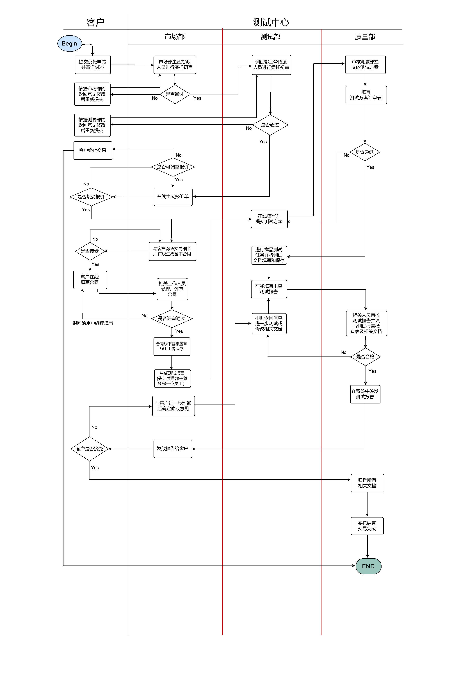

# “南大测试”在线管理平台

后端 D 组 && 前端 F 组

---

# 项目人员

## 前端

毕一帆（组长）、张宇晨（技术负责人）

蔡鸿彬、孙思敏、肖毓哲、严思远（成员）

## 后端

杨茂琛（组长）、孙逸扬（技术负责人）

戴显灏、姜宁、王岳、张世茂（成员）

---

# 工程背景

南京大学软件测试中心是具有国家资质认定的软件测试机构，可以向社会出具具有证明作用的数据和结果。

测试中心的日常业务主要是接取企业客户的软件测试委托，进行相关测试并给出测试结果。

长期以来，该机构一直使用基于填写word文档的方式管理整个业务流程，现在他们希望为整个业务流程搭建一个在线管理平台。

---

# 工程目标

- 将业务变为在线的web应用形式，客户通过前端页面进行数据填写，由后端服务将数据保存在专门的数据库中

- 项目以团队合作的形式进行，让学生体验团队合作的过程以及实际的软件开发工作

将传统的word文档改为现代化的web页面形式，能够促进南大测试中心的业务发展，带来更多的客户资源和合作机遇。作为南大的学生我们都有着扎实的专业基础、优秀的学习能力，可以在限定时间内完成既定的任务目标。

---

# 业务流程

测试平台的业务需要在多个角色交替执行，包括：

- 1位客户

- 3个部门（市场部、测试部、质量部）的主管及分配的员工

在线业务WEB应用可以帮助客户方便地完成对`业务申请管理`、`信息查询`等相关的全流程覆盖的服务，并能够为测试中心工作人员提供`从接受委托到完成整个委托`全流程的管理。

---

# 流程

平台基于一系列经过需求调研后既定的流程进行开发，对可能进行到的流程状态进行管理，并基于此提供服务和权限控制

`客户服务`提供身份验证。客户经`委托服务`提交申请后与市场部商谈，如顺利则进入`合同服务`并由工作人员维护其`样品服务`的信息；签订合同后产生`测试服务`的测试项目并进行测试、填写相应表单，由`文档服务`生成归档文件。

---

# 功能一览

- 用户管理：注册与维护用户；用户身份认证；用户授权
- 客户管理：客户注册；客户关系管理（CRM）；客户查询；
- 委托管理：在线委托；在线受理与审批，项目建立与查询；
- 合同管理：合同创建、修改、删除、评审、查询等管理；
- 样品管理：样品接收、流转、归还、归档、销毁、查询与维护
- 报告管理：报告编制、复核、批准、查询等管理；
- 测试项目管理：测试文档管理、测试报告管理、测试报告生成

---

# 时间线

- 3.21 小组建立
- 4.7 前端F组开始项目开发
- 4.10 技术栈确定，实现demo
- 4.15 后端D组开始项目开发
- 5.18 后端D组调研业务流程
- 5.28 前后端开始联合调试
- 6.24 后端D组完成业务代码
- 7.6 前端完成业务代码，联调结束
- 7.9 前后端完成文档

---

# 开发变动情况

## 项目合并

本前后端分离项目由两小组开发。

开发前期，两小组各自开发。在代码有一定规模时，两小组合并开发。

为应对这一变化，后端组在改动代码的同时及时更新 API 文档并告知前端组变动；前端组在调试发生异常时及时将完整的上下文、错误信息及调试日志发送至后端组。

---

# 开发变动情况

## 前后端需求适应

本前后端分离项目由两小组开发。

开发前期，后端组独立设计 API 接口，前端组独立设计页面。在开发量有一定规模后，两小组先互相沟通需求再给出设计方案，达成一致后再进行实际开发。

为应对这一变化，前端组、后端组进行每周至少 1 次的联合会议。在会上讨论相关的实现细节，使得后端可以更好提供数据的同时、前端可以轻松构建良好交互界面。

---

# Code

## 前端

Total : `525` files, `81933` codes, `1625` comments, all `86902` lines

## 后端

Total : `301` files, `20916` codes, `4062` comments, all `28488` lines

---

# 文档

| 名称 | 内容量 |
| ----  | ---- |
|设计说明书| `8` pages |
|测试报告| `36` pages |
|研发报告| `13` pages |
|重构报告| `6` pages |
|需求规格文档| `40` pages |
|接口文档| `157` pages |