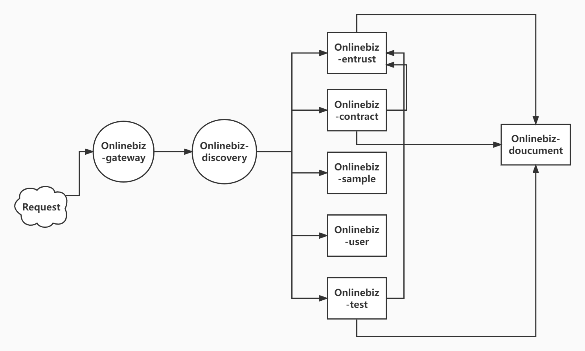
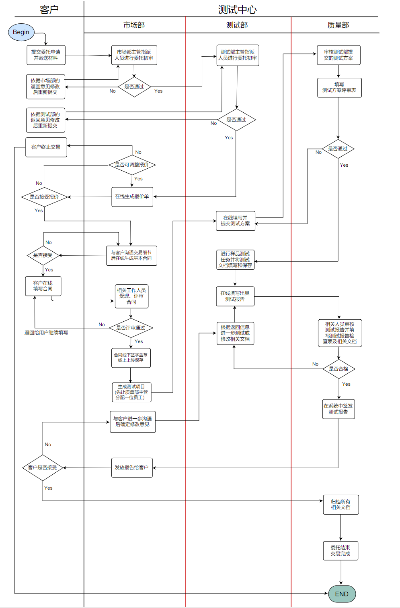

# 南京大学软件测试中心在线业务平台测试报告

**前端F组：**

**后端D组：杨茂琛	孙逸杨	戴显灏	姜宁	王岳	张世茂**

[toc]

## 引言

### 1.1	编写目的

对于前后端分布式系统开发，为了发现和报告应用服务的错误和缺陷，开发人员需通过一系列测试代码，包括**后端单元测试**、**集成测试**及**前后端联调**，以确保系统的功能、互操作性等符合软件的设计要求，满足用户的使用要求。而在测试过程中，通过分析错误产生的原因和错误的分布特征，可以帮助开发人员发现当前所采用的软件过程的缺陷，以便对系统进行升级时进行改进。预期参考人员包括用户、后台管理人员、开发人员和需要阅读本报告的甲方人员（三位指导老师及南京大学软件测试中心项目负责人员）。

### 1.2	项目背景

”南大测试“项目在线管理平台主要由三个部分构成，分别为：”南大测试“信息网站、”南大测试“在线业务WEB应用、”南大测试“在线业务微信公众号。主要是通过该项目在线管理平台提高业务处理的效率和管理的方便性，优化业务流程，同时为机构的服务质量提质，从整体上全面地提升客户的体验。三个部分相互辅助，从不同维度为用户提供服务，信息网站可以提供用户对机构主体或业务信息的了解咨询需求；在线业务WEB应用可以使用户方便地完成对业务申请管理、信息查询等相关的全流程覆盖的服务；在线业务微信公众号符合当前移动互联网时代用户新的需求，作为在线业务应用的延伸，可以为客户提供一个方便快捷的访问接口应用，使客户可以随时随地方便地进行主要功能的在线访问。

### 1.3	系统简介

> **服务间的相互调用**

> **基本业务流程**

### 1.5	参考资料

《南京大学软件测试中心在线业务平台需求文档》

《南京大学软件测试中心在线业务平台设计说明书》

《南京大学软件测试中心在线业务平台用户手册》

GB/T 25000.51-2016 《系统与软件工程 系统与软件质量要求和评（SQuaRE） 第51部分：就绪可用软件产品（RUSP）的质量要求和测试细则》

## 测试概要

本项目测试环节主要包含后端单元测试、后端集成测试与前后端联调部分。后端单元测试覆盖了所有服务的service层及DAO层，后端集成测试覆盖了所有项目流程主干及各分支，前后端联调部分覆盖所有服务的Controller层以及对后端测试进行了补充完善。

### 2.1	测试环境及配置

<table>
    <tr>
        <td colspan="4" style="text-align:center">数据库服务器配置</td>
    </tr>
    <tr>
        <td>机器名（IP）</td>
        <td>CPU</td>
        <td>内存</td>
        <td>软件环境（操作系统、应用软件）</td>
    </tr>
    <tr>
        <td>124.221.156.98</td>
        <td></td>
        <td></td>
        <td>MySql</td>
    </tr>
    <tr>
        <td>124.221.156.98</td>
        <td></td>
        <td></td>
        <td>MongoDB</td>
    </tr>
    <tr>
        <td colspan="4" style="text-align:center">应用服务器配置</td>
    </tr>
    <tr>
        <td>机器名（IP）</td>
        <td>CPU</td>
        <td>内存</td>
        <td>软件环境（操作系统、应用软件）</td>
    </tr>
    <tr>
        <td>210.28.133.13</td>
        <td>Intel(R) Xeon(R) Silver 4114 CPU @ 2.20GHz, 8 Cores</td>
        <td>16GB</td>
        <td>Linux ubuntu 4.15.0-187-generic #198-Ubuntu SMP Tue Jun 14 03:23:51 UTC 2022 x86_64 x86_64 x86_64 GNU/Linux</td>
    </tr>
    <tr>
        <td colspan="4" style="text-align:center">客户端配置</td>
    </tr>
     <tr>
        <td>172.26.30.68</td>
        <td>Intel(R) Core(TM) i5-9300H CPU @ 2.40GHz, 4 Cores</td>
        <td>16GB</td>
        <td>Windows 10 家庭中文版 版本号 21H2 19044.1766</td>
    </tr>
</table>

### 2.2	测试方法及工具

|  测试内容  |                         测试方法                          |                 测试工具                 |
| :--------: | :-------------------------------------------------------: | :--------------------------------------: |
|    功能    | 单元测试、集成测试、前后端联调 | Junit、APIfox |
|   可靠性   | 单元测试、集成测试、前后端联调 | Junit、APIfox |
|   安全性   |                         静态分析                          |                  CodeQL                  |
|   兼容性   |                    跨系统平台运行软件                     |                                          |
| 安装和手册 |                       实际安装内测                        |                                          |

### 2.3	测试概要分析表

<table>
    <tr>
        <td style="text-align:center">模块名称</td>
        <td style="text-align:center">测试类型</td>
        <td style="text-align:center">内部测试结果说明</td>
    </tr>
    <tr>
        <td rowspan = "3" style="text-align:center">委托申请服务</td>
        <td style="text-align:center">功能测试</td>
        <td style="text-align:center">通过</td>
    </tr>
    <tr>
        <td style="text-align:center">安全性测试</td>
        <td style="text-align:center">通过</td>
    </tr>
    <tr>
        <td style="text-align:center">兼容性测试</td>
        <td style="text-align:center">通过</td>
    </tr>
    <tr>
        <td rowspan = "3" style="text-align:center">合同服务</td>
        <td style="text-align:center">功能测试</td>
        <td style="text-align:center">通过</td>
    </tr>
    <tr>
        <td style="text-align:center">安全性测试</td>
        <td style="text-align:center">通过</td>
    </tr>
    <tr>
        <td style="text-align:center">兼容性测试</td>
        <td style="text-align:center">通过</td>
    </tr>
    <tr>
        <td rowspan = "3" style="text-align:center">测试项目服务</td>
        <td style="text-align:center">功能测试</td>
        <td style="text-align:center">通过</td>
    </tr>
    <tr>
        <td style="text-align:center">安全性测试</td>
        <td style="text-align:center">通过</td>
    </tr>
    <tr>
        <td style="text-align:center">兼容性测试</td>
        <td style="text-align:center">通过</td>
    </tr>
    <tr>
        <td rowspan = "3" style="text-align:center">文档服务</td>
        <td style="text-align:center">功能测试</td>
        <td style="text-align:center">通过</td>
    </tr>
    <tr>
        <td style="text-align:center">安全性测试</td>
        <td style="text-align:center">通过</td>
    </tr>
    <tr>
        <td style="text-align:center">兼容性测试</td>
        <td style="text-align:center">通过</td>
    </tr>
    <tr>
        <td rowspan = "3" style="text-align:center">用户服务</td>
        <td style="text-align:center">功能测试</td>
        <td style="text-align:center">通过</td>
    </tr>
    <tr>
        <td style="text-align:center">安全性测试</td>
        <td style="text-align:center">通过</td>
    </tr>
    <tr>
        <td style="text-align:center">兼容性测试</td>
        <td style="text-align:center">通过</td>
    </tr>
    <tr>
        <td rowspan = "3" style="text-align:center">样品服务</td>
        <td style="text-align:center">功能测试</td>
        <td style="text-align:center">通过</td>
    </tr>
    <tr>
        <td style="text-align:center">安全性测试</td>
        <td style="text-align:center">通过</td>
    </tr>
    <tr>
        <td style="text-align:center">兼容性测试</td>
        <td style="text-align:center">通过</td>
    </tr>
</table>

## 功能及安全性测试

### 3.1	测试概要-单元/集成测试

| 模块名称     | 用例数（个） | 用例通过数（个） | 问题数（个） | 用例通过率 |
| ------------ | ------------ | ---------------- | ------------ | ---------- |
| 委托申请服务 | 56           | 56               | 0            | 100%       |
| 合同服务     | 33           | 33               | 0            | 100%       |
| 测试项目服务 | 127          | 127              | 0            | 100%       |
| 文档服务     | 16           | 16               | 0            | 100%       |
| 用户服务     | 62           | 62               | 0            | 100%       |
| 样品服务     | 13           | 13               | 0            | 100%       |

> **功能测试**

单元测试部分巧妙地运用了mock技术，将测试与数据层切割开来，当测试代码每次调用DAO层时，都会将该方法拦截，并返回一个我们预设的初值，这样我们就可以规避掉冗余的流程来生成每一个数据库中的数据样品，从而可以绕开流程限制，顺利地进行单元测试。

集成测试部分我们将单一服务模块中的流程抽象出来，模拟了整个模块流程的主干及分支情况，达到了较高的流程覆盖率。

> **安全性测试**

安全性测试主要指测试代码是否能够通过权限校验与阶段校验，将服务器接收到的请求在service层筛选，拦截错误权限访问及错误阶段访问请求。这一部分主要在单元测试中完成，通过mock 不同权限的用户、不同阶段发出的请求来确保平台系统的安全性。

### 3.2	测试概要-前后端联调

## 兼容性测试

|               测试情况                | 检查结果 |
| :-----------------------------------: | :------: |
|        是否自适应浏览器Firefox        |    是    |
|         是否自适应浏览器Edge          |    是    |
|        是否自适应浏览器Chrome         |    是    |
|      是否可以部署在Windows服务器      |    是    |
|       是否可以部署在Linux服务器       |    是    |
|        是否可以部署在MacOS主机        |    是    |
| 客户端是否可以在Windows操作系统下访问 |    是    |
|  客户端是否可以在Linux操作系统下访问  |    是    |
|  客户端是否可以在MacOS操作系统下访问  |    是    |

我们将平台系统分别部署在指导老师提供的Linux服务器、后端组同学租用的Windows服务器、后端组同学本地MacOS主机上，并通过不同系统（Windows、Linux、MacOS）上的不同浏览器（Firefox、Edge、Chrome）访问该平台，发现兼容性良好，证明平台具有可观的兼容性。

## 整体测试结果分析

### 5.1	测试总结分析

本软件在经过测试联调及代码修改后，测试结构已达到预期（测试用例通过率100%，绝大部分达到90%覆盖率）

### 5.2	测试的缺陷和限制

本软件的测试内容并不能达到很好的压力测试及性能测试，即我们尚不能保证在所有环境的运行状态下服务器能够达到的访问容量，我们只能保证在现有条件下（即指导老师提供的服务器上），平台系统能够容纳高额的访问率及吞吐量

