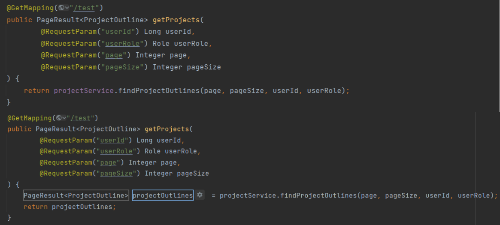
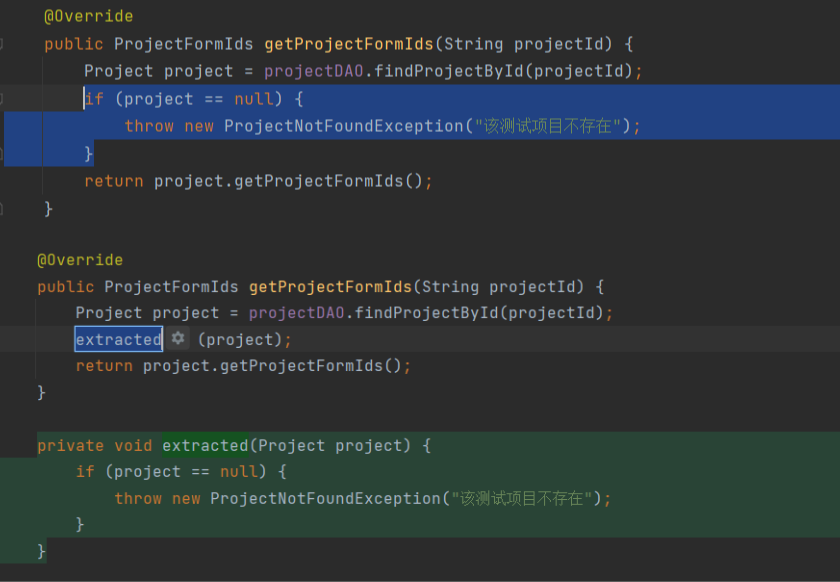

<center><h1 style="zoom:125%">项目重构报告</h1></center>


## 行为定义

在计算机编程和软件设计中，代码重构是重组现有计算机代码的过程——改变过程，而不改变其外部行为。重构的目的是改善软件的设计、结构和/或实现（其非功能属性），同时保留其功能。重构的潜在优势可能包括提高代码的可读性和降低复杂性；这些可以提高源代码的可维护性，并创建一个更简单、更干净、或更有表现力的内部架构或对象模型，以提高可扩展性。重构的另一个潜在目标是提高性能；软件工程师面临着一个持续的挑战，即编写性能更快或者使用更少内存的程序。


## 重构动力

本项目为前后端分离项目。

前端或后端在开发的过程中，对于数据接口、数据展示在不同的时间阶段有不同的要求、预期。当项目进入进入新时期时，过去的代码尽管能够表现正确的外在行为，但其内部实现于高可读性、低复杂性、高可维护性、高扩展性上表现不佳。

重构的动机通常是注意到代码的异样。例如，某一方法可能非常长，或者它可能与附近的另一个方法几乎重复。一旦发现，这些问题就可以通过重构源代码来解决，或者将其转化为一种新的形式，其行为与以前一样，但不再有异样了。

对于一个长的过程，可以提取一个或多个较小的子过程；或者对于重复的过程，可以删除重复的部分，用一个共享函数代替。不进行重构会导致技术债务的积累；另一方面，重构是偿还技术债务的主要手段之一。


## 常用手段

本项目的开发中使用了许多业界领先的重构技术。基于成熟的重构技术进行重构，可以大大缩短团队的开发时间并保证开发质量。


- 引入变量

将光标高亮的代码部分抽离出原本的语句（通常是链式调用）作为单独的变量（或常量），开发者可以对引入的变量进行额外的查看、操作。




- 提取方法

将光标高亮的代码部分抽离出原本的方法作为单独的、依实际情况可能有参数、依实际情况可能有返回值的新的方法。开发者将多处重复的代码段提取为新方法并在重复处替换为新方法。




## 后端重构记录

后端共进行了 3 次重构。


### 第 1 次重构

重构动机：现有的委托服务、合同服务的接口与实际业务流程稍有不同，与实际业务流程的结合的紧密程度不高；团队期望通过重构，提升代码的可读性、可维护性。

参与人员：孙逸扬

时间起止：2022.05.19 - 2022.05.21

重构内容：重构委托服务、合同服务，相应地调整用户服务、网关服务

提交记录：

```
from  6f61722b660115de2554dacbadb277b1f11d92aa  to  7967bf22ef571fd8e6a00ddffc6aa3fa77dc4f5a

119		files changed
4,832	additions
2,850	deletions
```


### 第 2 次重构

重构动机：测试服务的状态原设计由各子数据表自行维护，在实际前端展示时不够自然合理；团队期望通过抽取各子数据表的状态、结合业务流程，将项目的总体状态抽象并集中于测试项目数据结构中。重构后，前后端无需再维护各子数据表的状态，只需根据测试项目的状态即可把握流程。

参与人员：杨茂琛、王岳、姜宁、戴显灏

时间起止：2022.06.05 - 2022.06.22

重构内容：重构测试服务的状态相关内容、数据表之间交互相关内容

提交记录：

```
from  9e2697eb6bf484f1c3e4bc0502eff5242b385d46  to  2214fec3686989cc6dcc881f509828447d83acf2

83		files changed
1,152	additions
868		deletions
```


### 第 3 次重构

重构动机：通过使用静态分析工具 codeQL 扫描代码，团队发现了潜在的安全威胁；团队期望通过如加强用户输入校验、过滤用户输入等方式消除已知的安全威胁。

参与人员：杨茂琛、张世茂

时间起止：2022.06.29 - 2022.06.29

重构内容：重构文档服务中前端传入的内容作为文档路径或方法参数的相关内容

提交记录：

```
from  f37535626241b02001bb6339479e1db25fecae38  to  9c8a16a26084f3add39e5d4da855ee6adb06ecf6

21		files changed
257		additions
78		deletions
```

## 前端重构记录

### 第 1 次重构

重构动机：
1、在部署到服务器上后，原有的页面跳转会出现问题，在更换为hook方法后不能在class中使用，因此改为const。
2、用了大量的state来保存表单数据，会给dom的“比较-更新”式渲染造成很大的负担，而且也不利于状态的更新保存。

参与人员：肖毓哲，严思远

时间起止：2022.05.19 - 2022.05.21，2022.06.26 - 2022.06.27

重构内容：填表页面、审核页面

提交记录：

```

commit d5f220e7e7ace54f2da9b482d04a9b961b5cee8a

2		files changed
674	    additions
787	    deletions

commit  5c6a663f1445e42e1754114312e4d8c06e6b7551

2       files changed
202     additions
275     deletions

```

### 第 2 次重构

重构动机：
1、原先使用useEffect()钩子来获取数据的用法较为复杂，且具有出错的可能性。
2、为实现加载时页面的可视化，需要额外实现loading界面
3、使用antdpro自带的request方法能够轻松解决上述问题

参与人员：蔡鸿彬

时间起止：2022.05.28 - 2022.05.29

重构内容：填表页面和展示页面

提交记录：

```

commit ca14d2f4093ebee2b25e8586d3f50f78c73141d2

5       files changed
1202    additions
1181    deletions

```

### 第 3 次重构

重构动机：原本使用 url 传参的方式进行页面跳转，但是部署到服务器上后这种方式会出现 404 的错误，因此全部改为 history.push({ query: xx }) + useLocation()。

参与人员：严思远，毕一帆

时间起止：2022.06.05 - 2022.06.10 , 2022.06.26 - 2022.06.27

提交记录：

```
commit 97616c8886cefc5da6be227c0134d4967d1e6141

7       files changed
156     additions
146     deletions

commit 76b42072de1f1e9cdb9fd2906e8c9eb75970de67

17      files changed
471     additions 
323     deletions

commit ea785669983426959d3af98fc34c5b36f4151a67

40      files changed
6,095   additions 
50      deletions

```

### 第 4 次重构

重构动机：原有的页面布局和排版稍显杂乱，对于用户浏览各项内容而言体验仍有待改进，使用ProCard组件对一些页面的展示进行布局修改，页面代码结构更加清晰，前端展示效果也更优秀。

参与人员：张宇晨，蔡鸿彬

时间起止：2022.07.01 - 2022.07.05

提交记录：

```

from e872a1f4cbce7670585155dedc903fec2e86473a
to bbf03114967796e6f71696fca8896c47f4147000

5       files changed
294     additions
4       deletions

from 78783ea4fd638764d6b3afa6ea74ccb84c6d0c8d
to 251f712a2cbaa3201b454f24188d624279dd879c

3		files changed
540		additions
16		deletions

from c226faf5f5935e3b4c70740f0e32cbc58632f85b
to 414b8c9463114315935fb06c44b4a5de10a4328a

2		files changed
524		additions
593		deletions

from 9038094e89b8fe85f8ddf7ece196231e2aac11f5
to 15fa337f32940726b941e452e1f97ed1e1803dae

1		files changed
304		additions
171		deletions
```

